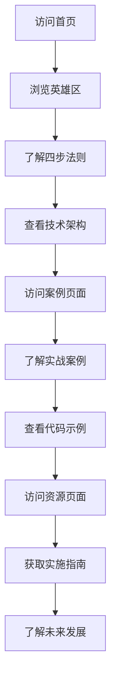

## 1. Product Overview
AI技巧：全自动哄老婆四步法则 - 基于数字游牧人Samuel的原创方法，利用AI技术实现自动化的情感关怀系统。
- 帮助忙碌的现代人更好地维护家庭和谐，通过AI技术实现自动化的情感关怀
- 目标用户为希望改善家庭关系的忙碌专业人士，市场价值在于节省时间并提升情感连接质量

## 2. Core Features

### 2.1 User Roles
| Role | Registration Method | Core Permissions |
|------|---------------------|------------------|
| User | 无需注册 | 浏览所有内容，查看四步法则，了解技术实现 |

### 2.2 Feature Module
1. **Home page**: 英雄区，四步法则介绍，技术架构展示
2. **Case Study page**: 实战案例演示，代码示例
3. **Resources page**: 实施指南，最佳实践，未来发展

### 2.3 Page Details
| Page Name | Module Name | Feature description |
|-----------|-------------|---------------------|
| Home page | 英雄区 | 展示项目标题和核心价值，包含引人注目的视觉效果和CTA按钮 |
| Home page | 四步法则 | 详细介绍数据收集、智能提醒、自动执行、效果评估四个步骤 |
| Home page | 技术架构 | 展示系统架构图和技术栈选择 |
| Case Study page | 实战案例 | 通过时间线展示智能纪念日提醒系统的完整流程 |
| Case Study page | 代码示例 | 展示智能消息生成的核心算法代码 |
| Resources page | 实施指南 | 提供详细的实施步骤和最佳实践 |
| Resources page | 未来发展 | 探讨技术发展方向和应用扩展场景 |

## 3. Core Process
用户访问网站后，首先看到英雄区的核心价值介绍，然后可以浏览四步法则的详细内容，查看技术架构和实战案例，最后获取实施指南和未来发展信息。

## 4. User Interface Design
### 4.1 Design Style
- 主色调：深蓝色 (#1e3a8a) 和亮蓝色 (#3b82f6)
- 辅助色：紫色 (#6366f1) 和粉色 (#ec4899)
- 按钮风格：圆角设计，带有微妙的阴影和悬停效果
- 字体：使用现代无衬线字体，标题使用较大字号和粗体
- 布局风格：卡片式布局，清晰的视觉层次，充足的留白
- 图标风格：使用简约现代的线性图标

### 4.2 Page Design Overview
| Page Name | Module Name | UI Elements |
|-----------|-------------|-------------|
| Home page | 英雄区 | 全屏渐变背景，大标题，副标题，CTA按钮，微妙的背景动画 |
| Home page | 四步法则 | 卡片式布局，每个步骤包含数字标识，标题，描述和功能列表 |
| Home page | 技术架构 | 左右布局，左侧技术栈卡片，右侧系统架构图 |
| Case Study page | 实战案例 | 时间线设计，每个阶段包含标题和描述 |
| Case Study page | 代码示例 | 暗色背景的代码块，语法高亮，复制功能 |
| Resources page | 实施指南 | 步骤式列表，最佳实践卡片 |
| Resources page | 未来发展 | 网格布局展示不同应用场景 |

### 4.3 Responsiveness
- 采用移动优先的响应式设计
- 在不同屏幕尺寸下自动调整布局
- 触摸设备优化，确保按钮和交互元素易于点击
- 关键内容在各种设备上保持清晰可见

### 4.4 3D Scene Guidance
- 不适用，本项目为2D网页应用