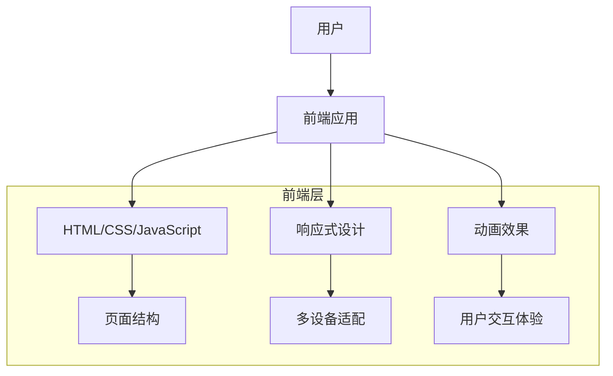

## 1. Architecture Design

## 2. Technology Description
- Frontend: HTML5 + CSS3 + JavaScript
- Initialization Tool: 直接创建静态HTML文件
- Backend: 无 (纯静态网站)
- Database: 无 (纯静态网站)

## 3. Route Definitions
| Route | Purpose |
|-------|---------|
| / | 首页，包含英雄区、四步法则和技术架构 |
| /case-study | 实战案例页面，包含案例演示和代码示例 |
| /resources | 资源页面，包含实施指南和未来发展 |

## 4. API Definitions
- 不适用，本项目为纯静态网站，无后端API

## 5. Server Architecture Diagram
- 不适用，本项目为纯静态网站，无后端服务器

## 6. Data Model
- 不适用，本项目为纯静态网站，无数据库

### 6.1 Data Model Definition
- 不适用

### 6.2 Data Definition Language
- 不适用